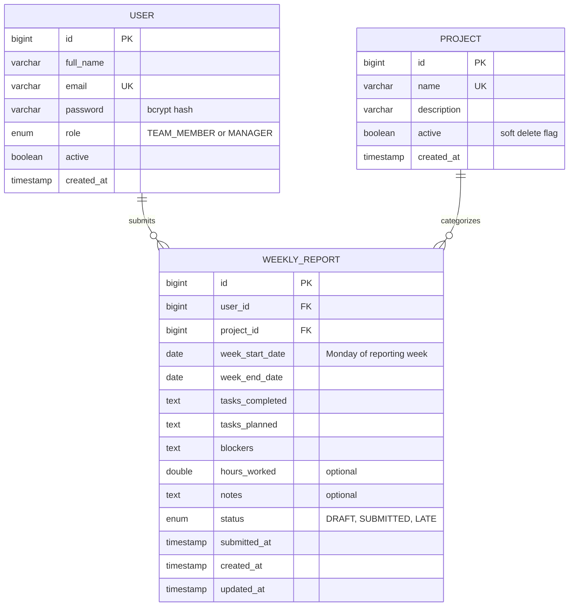

# Entity Relationship Diagram

This renders automatically when viewed on GitHub. You can also paste the code block
below into [Mermaid Live Editor](https://mermaid.live) to export a PNG/SVG or get a
shareable link for the submission.

## Design notes

- **User ↔ Role**: role is a single enum column on `USER` (`TEAM_MEMBER` / `MANAGER`)
  rather than a separate roles table, since roles here are fixed and mutually
  exclusive per user — this keeps auth checks a single-column read on every request.
- **User ↔ WeeklyReport**: one-to-many. A user can have many reports, one per
  (week, project) pair — enforced by a unique constraint on
  `(user_id, week_start_date, project_id)` so the same person can't double-submit
  for the same week and project.
- **Project ↔ WeeklyReport**: one-to-many. Deleting a project is a **soft delete**
  (`active = false`) rather than a hard delete, so historical reports referencing
  it stay intact and the dashboard's trend charts remain accurate.
- **Fixed report shape**: every column on `WEEKLY_REPORT` is a real column, not a
  flexible key-value store — this is what guarantees every user's report has the
  exact same fields in the exact same order, so reports stay comparable across the
  team on the manager dashboard (a core requirement of the brief).
